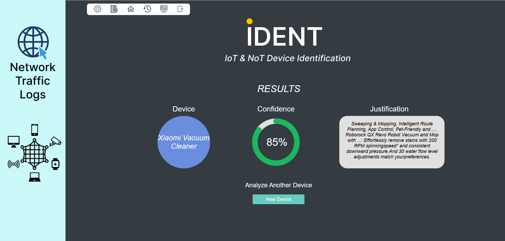
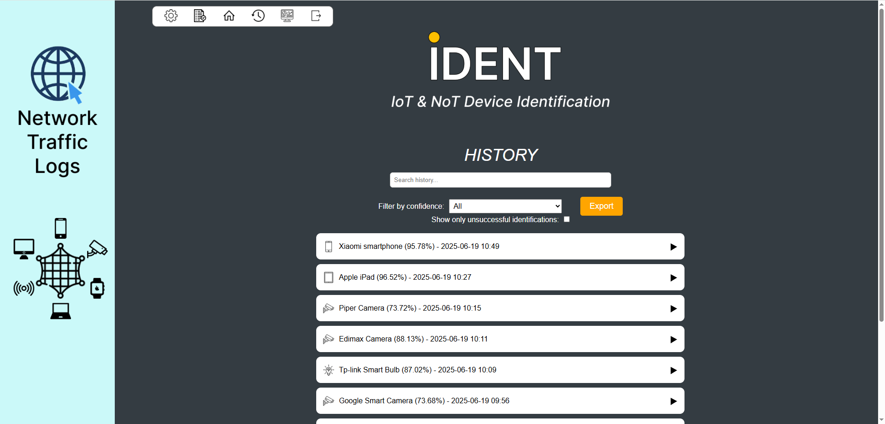
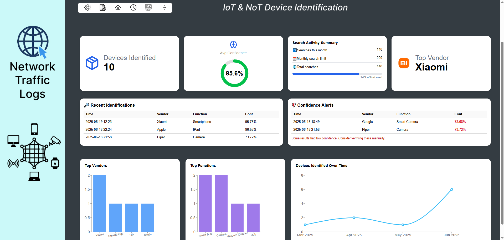

# IDENT

**Labeling System for Unseen IoT and NoT Devices**

IDENT is a web-based tool designed to help IT professionals identify and label unknown IoT and NoT devices in their network, offering visibility and insight into connected endpoints.

---

## 🌟 Features

* 🔍 **IoT Device Identification** using:

  * String matching for vendor labeling
  * BART model for function labeling
* 📂 **Two input methods**:

  * Upload a JSON file in the specified format
  * Manually input device data via UI
* 📊 **Dashboard view** summarizing:

  * Number of devices identified
  * Average confidence score
  * Top vendors and functions
  * Activity timeline of recent identifications

* ☁️ **Cloud Integration**:

  * AWS S3 for storing input, enriched, and result files
  * DynamoDB for secure user account storage
* 🧠 **Natural Language Justification** for model predictions
* 🔐 User authentication and history tracking

---

## 🚀 Getting Started

### Prerequisites

* Python 3.10+
* Node.js & npm
* AWS credentials for S3/DynamoDB (if running locally)

### Backend Setup

```bash
cd src/backend
pip install -r requirements.txt
python manage.py runserver 5000
```

### Frontend Setup

```bash
cd src/frontend
npm install
npm start
```

---

## 📥 Input Format

You can upload a `.json` file like this:

```json
{
  "device_sample.csv": {
    "dns.ptr.domain_name": [],
    "dhcp.option.hostname": [],
    "x509ce.dNSName": ["example.domain.com"],
    "http.user_agent": [],
    "tls.handshake.extensions_server_name": [],
    "mac_address": "00:11:22:33:44:55",
    "dns.qry.name": ["example.com", "pool.ntp.org"]
  }
}
```

Or use the **manual input** option through the web UI.

---

## 🧠 How It Works

* **Vendor Labeling**: A string-matching algorithm compares the vendor catalog against the enriched data extracted from the input.
* **Function Labeling**: A BART-based LLM classifies the device’s function using enriched context, and provides a confidence score along with a natural language justification.
* **Data Storage**:

  * All files are stored in AWS S3 under a user-specific folder structure
  * User metadata and history are stored in DynamoDB

---

## 📈 Architecture

* **Frontend**: React
* **Backend**: Django REST Framework
* **LLM**: BART model (via Hugging Face Transformers)
* **Cloud**: AWS S3, AWS DynamoDB
* **Enrichment**: SerpAPI for context fetching

---

## 📺 Demo

[Watch the Demo on YouTube](https://www.youtube.com/watch?v=tJtfH9hNl5I)

---

## 🖼️ Screenshots

<details>
<summary>📷 Click to expand</summary>

* **Input Screen**
  

* **Result Screen**
  

* **History Screen**
  

* **Dashboard Screen**
  
</details>

---

## 🧪 Future Improvements

IDENT is planned to be enhanced with the ability to **auto-update the function catalog** upon encountering devices with new or unknown functions.

Another upcoming feature is **Two-Factor Authentication (2FA)** to strengthen account security.

---

## 📚 References

This project is based on the approach described in the paper:  
“Reading Between the Strings: Breaking Down IoT Device Labeling Barriers with LLM” 
[https://arxiv.org/abs/2403.01586v1](https://arxiv.org/abs/2403.01586v1)

---

## 📚 License

This project is submitted as part of an academic course. Contact the author for reuse permissions.

---

## ✨ Author

**Tal Flint**